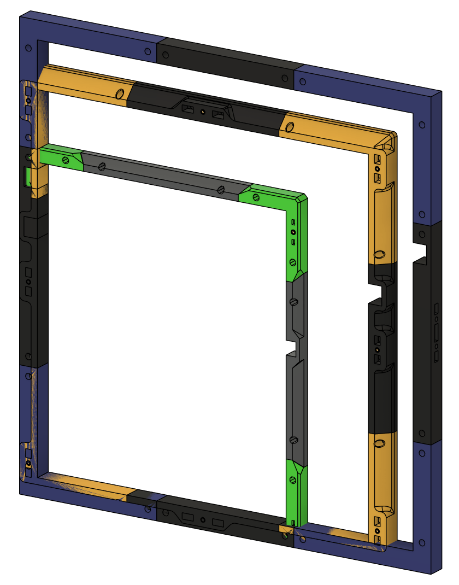

#  DoorBuffer V2

&nbsp;&nbsp;&nbsp;&nbsp;&nbsp;&nbsp;
<a href="https://github.com/sponsors/DraftShift" target="_blank" alt="Sponsor Us">&color=rgb(191%2C%2057%2C%20137))</a>

Simple printable doorbuffer to claw back 15-20mm without upgrading the front frame. 

## WARNING: Calibrate shrinkage before you print. These are long pieces and errors will show.

### Now supports stock, Clacky, and Micron rev 1 doors

## BOM
Aditional hardware outside the doors
### Stock voron doors
* 22x M3 T-Nut
* 20x M3x8mm SHCS to hold the bracket
* 2x M3x20mm to hold the crossbar
* 8x M3 heat inserts for door mounting
### Klicky-Clack
* 22x M3 T-Nut
* 20x M3x8mm SHCS to hold the bracket
* 2x M3x20mm to hold the crossbar
* 6x M3 heat inserts for door 
### Micron
* 18x M3 nut
* 16x M3x8mm SHCS to hold the bracket
* 2x M3x16mm to hold the crossbar
* 4x M3 heat inserts for door 
* 2x M3x6mm FHCS for door magnets
