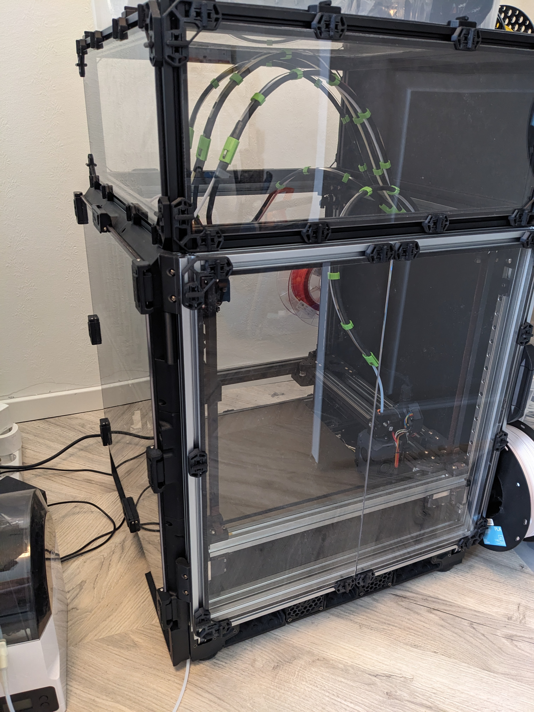
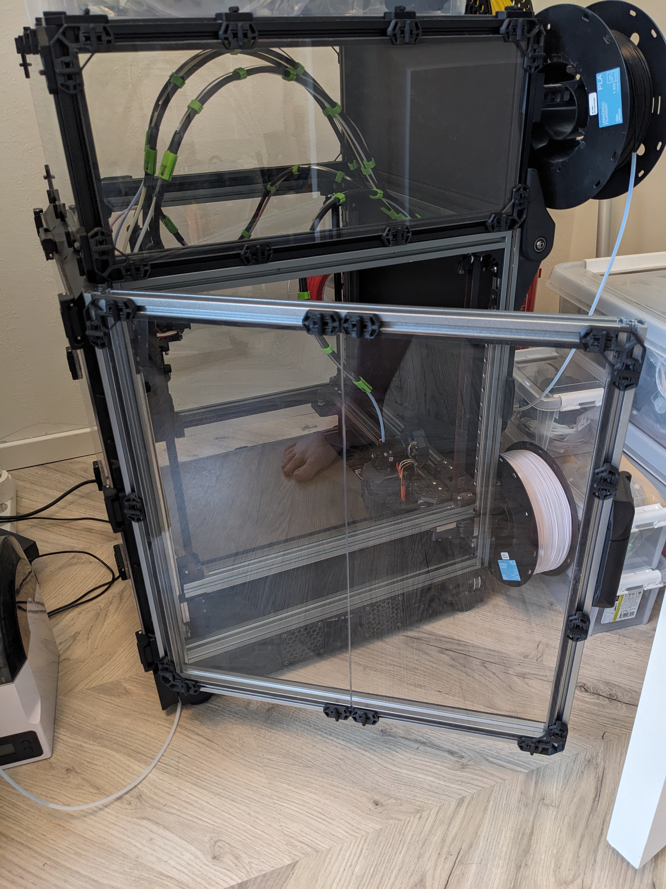
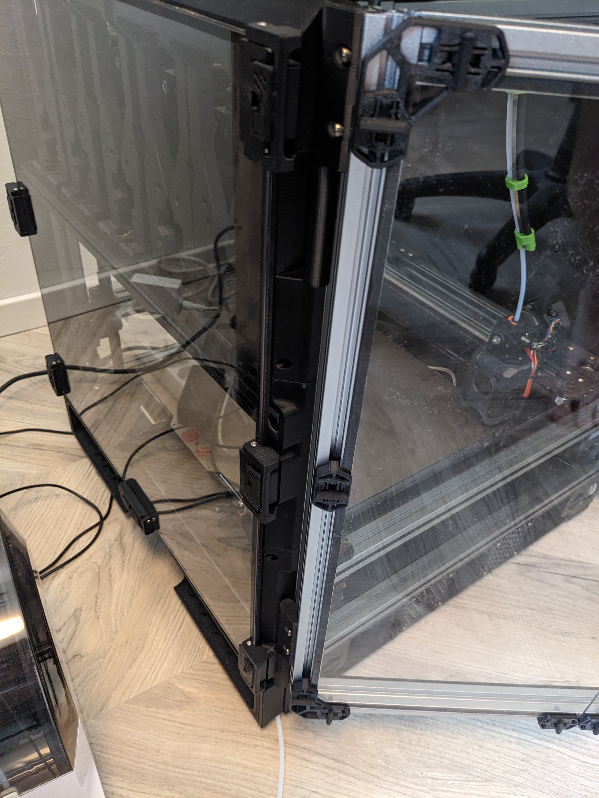
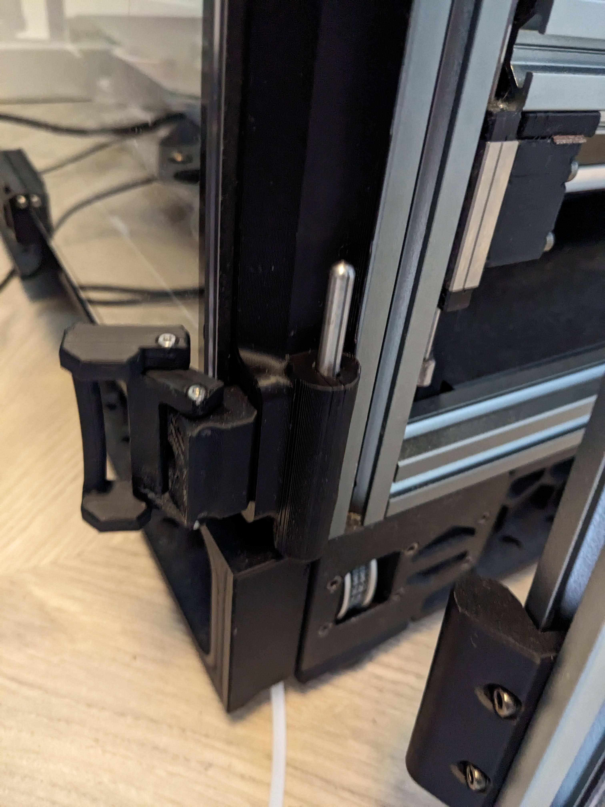
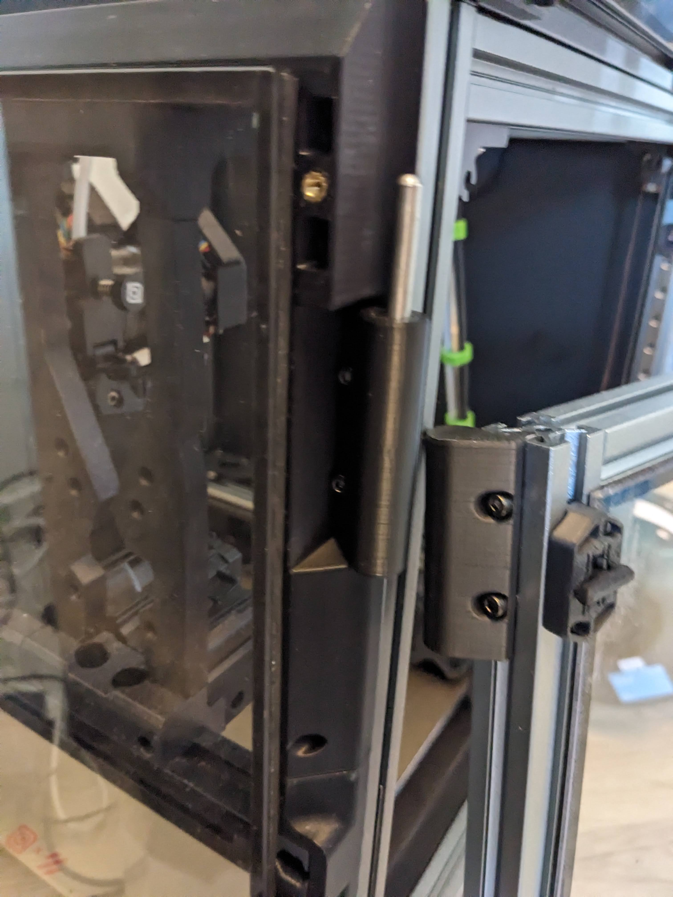

# Doorbuffer Clicky-Clack Side Door

The Stock Voron V2 doors suck. Adding an additional 20mm more out the front to mount Clicky-Clack fridge door not too tempting?
Want to have access to your umbilicals and electronics on the back?
Feel like the docks are in the way when reaching for prints?

Add a ClickyClacky Fridge Door to the side of your printer instead with this mod!

## Description:
This Usermod replaces the right top and bottom corners of the door-buffer and uses most of the original parts from the Clicky-Clack Fridge door mod: https://github.com/tanaes/whopping_Voron_mods/blob/main/clickyclacky_door%2FREADME.md
Recommend using these hinges to move the side panel to the front so it's easily removeable: https://github.com/DraftShift/DoorBuffer/tree/main/UserMods/MikeYankeeOscarBeta/Doorbuffer_Side_Door_latches

It's designed for a 300 size Voron V2 with the normal height door-buffer, but should fit the other printer sizes for normal height docks.

by 
[MikeYankeeOscarBeta](https://github.com/MikeYankeeOscarBeta/) (VoronDesign Discord: #MikeyMike V2.5796, Voron Toolchangers Discord: MikeyMike - Github: [MikeYankeeOscarBeta](https://github.com/MikeYankeeOscarBeta/StealthChanger))
DraftShiftDesign Discord - user-project thread:    https://discord.com/channels/1226846451028725821/1243948065208008705

## Parts to print:
- 1x doorbuffer-300-clickyclacky-sidedoor_A_v2.stl
- 1x doorbuffer-300-clickyclacky-sidedoor_A_v2.stl

## BOM:
Unchanged. It uses all the same hardware as door buffer and clicky-clack fridge door.