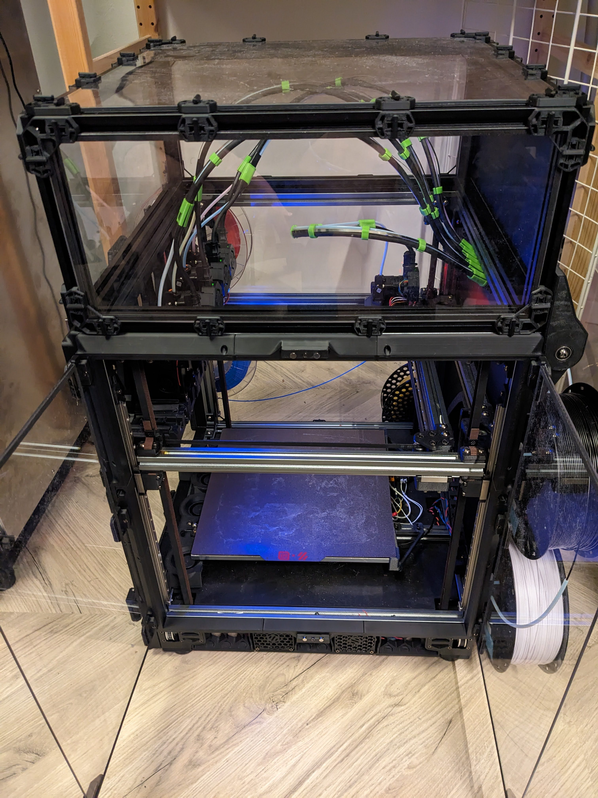
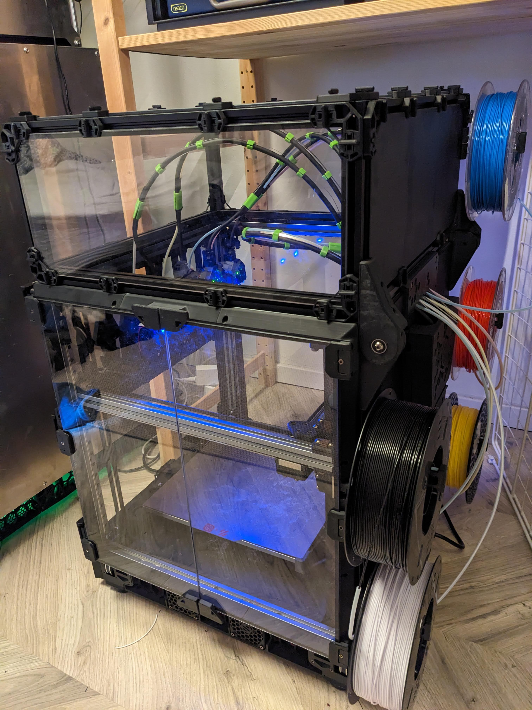
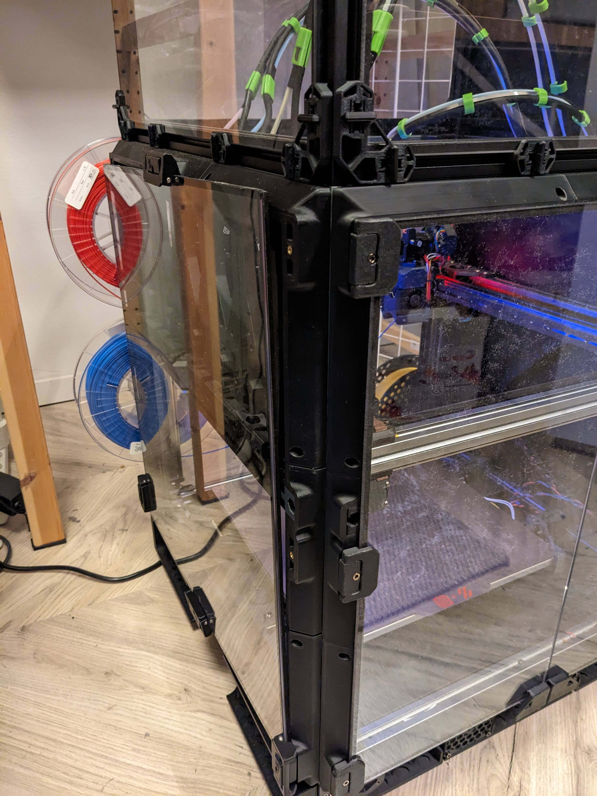

# Doorbuffer Side Door Latches

Swap your door with your sidepanel with two door-buffers and some clips.

A simple blank and a remix of RichardM's amazing snap latches 
[Voron 2.4 Filament Latch (or any 2020 extrusion)](https://www.printables.com/model/172368-voron-24-filament-latch-or-any-2020-extrusion)  
- remixed for m2 screws and 5.5mm (3mmpanel + 3mm foam - 0.5mm compression)

by 
[MikeYankeeOscarBeta](https://github.com/MikeYankeeOscarBeta/) (VoronDesign Discord: #MikeyMike V2.5796, Voron Toolchangers Discord: MikeyMike - Github: [MikeYankeeOscarBeta](https://github.com/MikeYankeeOscarBeta/StealthChanger))
DraftShiftDesign Discord - user-project thread:    https://discord.com/channels/1226846451028725821/1243948065208008705

## Parts to print:
- 2x Door Buffer
- 2x NewLatchWithHandle_m2x10mmSHCS_screw_normal_size_3mm_panel_3mm_foam_2_long.stl
- 6x NewLatchWithHandle_m2x10mmSHCS_screw_normal_size_3mm_panel_3mm_foam_2.stl
- 2x 2020_doorbuffer_adapter_blank_for_M5x16_BHCS_x2.stl

## BOM per latch (need 6 latches in total):
| Part                        | for       | Amount    | Description|
|-----------------------------|-----------|-----------|-|
| M3x12-14mm BHCS/SHCS Screw  | latch     | 6         | M3 BHCS/SHCS screw |
| M2x15mm SHCS Screw          | latch     | 4         | M2 SHCS screw |
| M3x25mm SHCS Screw          | latch     | 4         | M2 SHCS screw |
| M5x16 BHCS Screw            | Adapter   | 2         | M5 BHCS/SHCS |

