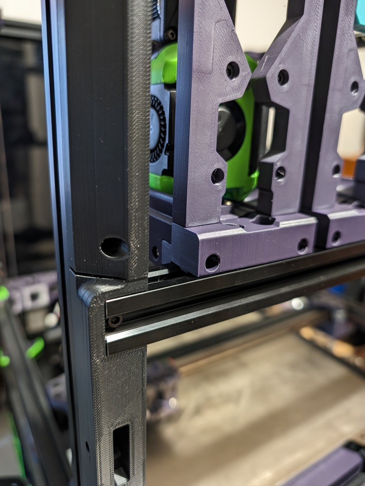
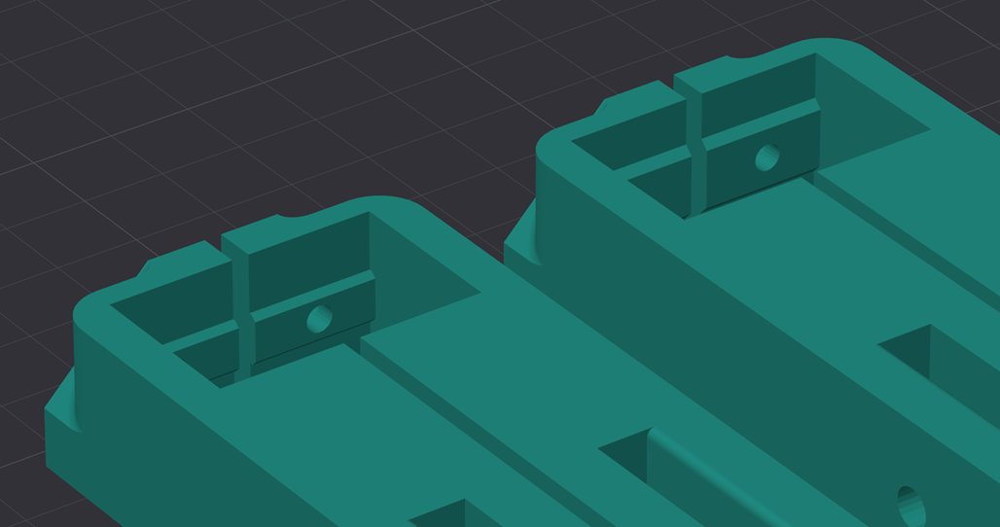
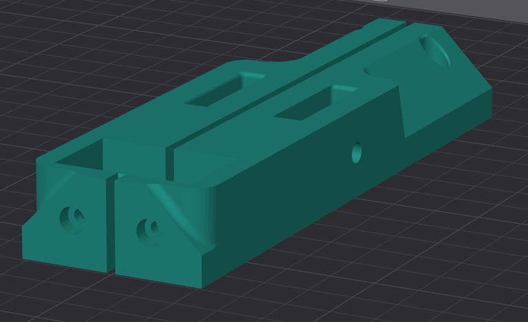

# Short Frame Buffer Mod

This mod add door buffer support for <a href="https://github.com/DraftShift/ModularDock/tree/main/UserMods/BlackShade/ShortFrame">BlackShade's Short Frame Dock Mod</a> for both 300mm and 350mm frames. It replaces the left and right middle sections of the door buffer and both T slot (default) and V slot versions are provided.

### Extra BOM
2x M3 6mm SHCS screws

 

 
